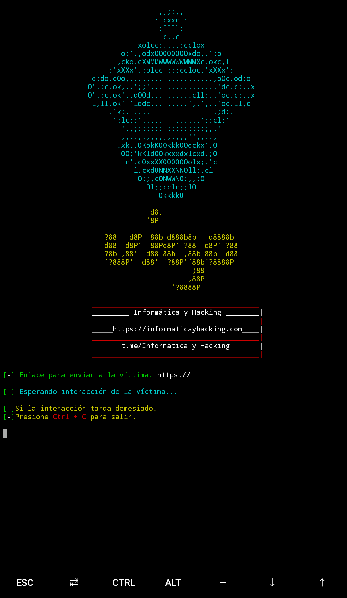

# vigo
<h1>Simple Herramienta para obtener fotografías del dispositivo que reciba el enlace.</h1>

Se usa un poco de ingeniería social, para lograr que la vícima otorgue permiso para usar su cámara y obtener fotografías a partir de ella.

 
<h2>Instalación:</h2>
 

<strong>En Termux, se necesita instalar Openssh y PHP:</strong>

pkg install openssh pkg install php

[-] <strong>git clone https://github.com/InformaticayHacking/vigo</strong>

[-] <strong>cd vigo</strong>

[-] <strong>pip install -r requirements.txt</strong>

Esta herramienta, funciona tanto en kali Linux, como en Termux.

 

Es recomendable ejecutar el tunel ssh por primera vez de forma manual.

<h2>Uso:</h2>
 

[-] <strong>python vigo.py</strong>

 

<strong>Página Web: </strong>https://informaticayhacking.com

<strong>Nuestro grupo en Telegram: </strong>https://t.me/Informatica_y_Hacking

